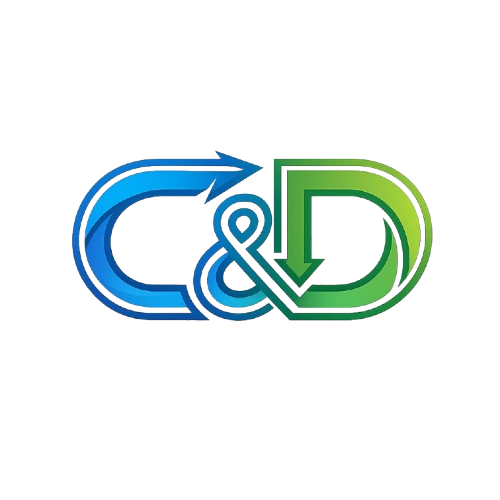
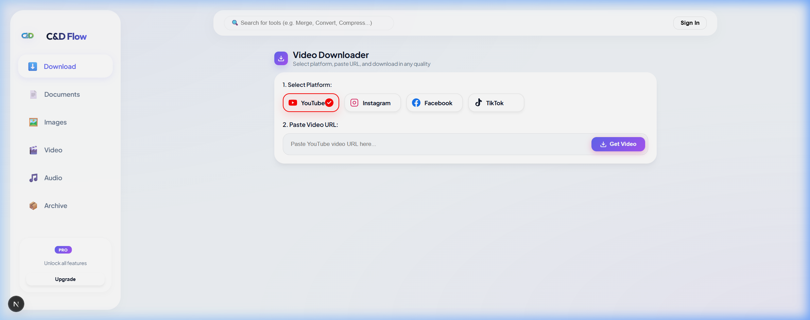
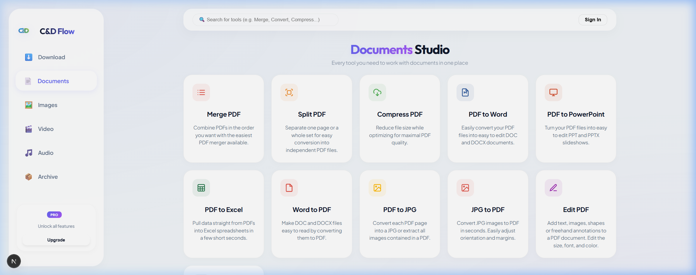
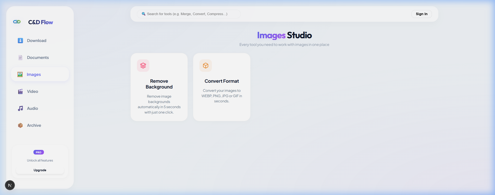
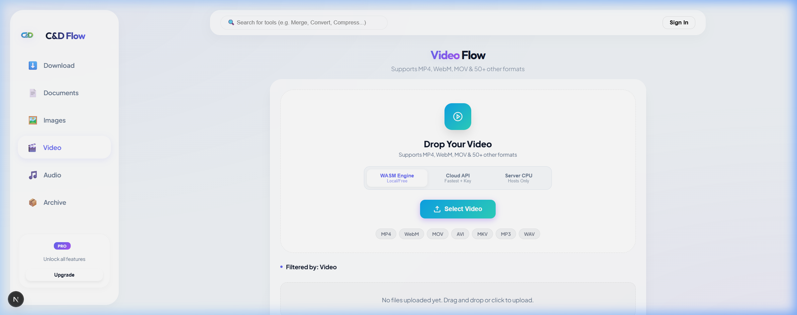
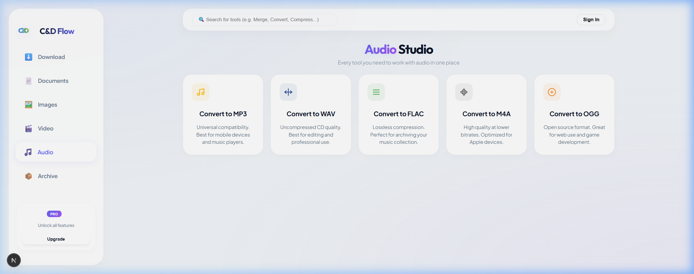

#  C&D Flow: Your Ultimate Digital Studio

> **Transform, Download, and Master Your Media with Effortless Intelligence.**

C&D Flow is an all-in-one media automation and document processing suite designed for creators, engineers, and power users. Built with a focus on speed, privacy, and high-fidelity output, it bridges the gap between complex file conversion tasks and a seamless user experience.

---

## ✨ Featured Modules

### 🎥 Multi-Platform Video Downloader
Extract high-definition media from **YouTube, Instagram, Facebook, and TikTok** with one-click. Supports multi-quality selection and lightning-fast detection.



### 📄 Professional Documents Studio (iLovePDF Style)
A full-featured PDF workshop at your fingertips.
- **Core Tools**: Merge, Split, Compress, and Watermark.
- **Conversion**: High-fidelity PDF to Word, Excel, and PowerPoint.
- **Visual Editor**: Integrated editor with AI-powered document reconstruction logic.



### 🖼️ AI-Powered Image Studio
Say goodbye to manual masking.
- **Background Removal**: Instant, privacy-first removal using local **WASM AI**.
- **Ultra Mode**: Professional-grade cloud processing for complex edges.
- **Format Wizard**: Convert to modern WEBP, AVIF, and high-quality PNG/JPG.



### 🎬 Video Flow Engine
A universal video converter supporting **50+ formats** (MP4, WebM, MOV, AVI, and more).
- **Hybrid Engines**: Choose between Client-Side WASM (Private), Server-CPU (Reliable), or Cloud API (Fastest).



### 🎵 Audio Pulse
Lossless audio conversion optimized for every device.
- **Profiles**: Best-in-class conversion for MP3, WAV, FLAC, M4A, and OGG.
- **Quality Control**: Custom bitrate and sample rate adjustment for audiophiles.



---

## 🏗️ Technical Architecture

C&D Flow leverages a hybrid processing model to ensure performance and reliability:

- **Frontend**: [Next.js](https://nextjs.org/) (App Router), [GSAP](https://gsap.com/) for fluid transitions, and a mobile-first responsive architecture.
- **Local Engines**: FFmpeg-WASM and @imgly AI for serverless, private client-side processing.
- **Cloud Connectors**: Integration with **CloudConvert**, **ConvertAPI**, and **RapidAPI** for heavy-duty batch processing.
- **Storage**: Intelligent temp caching for instantaneous downloads.

---

## 🚀 Getting Started

### Prerequisites
- Node.js 18.x or higher
- API Keys for CloudConvert, ConvertAPI, and Remove.bg (optional for cloud features)

### Installation

1. **Clone the repository**:
   ```bash
   git clone https://github.com/your-username/C-D-Flow.git
   ```

2. **Install dependencies**:
   ```bash
   npm install
   ```

3. **Configure Environment Variables**:
   Create a `.env.local` file and add your configuration (see `.env.example` if available).

4. **Launch the Studio**:
   ```bash
   npm run dev
   ```

The application will be live at [http://localhost:3000](http://localhost:3000).

---

## Support & Contribution
We are constantly adding new "Flows" to the studio. If you'd like to contribute or report an issue, feel free to open a PR or a discussion on GitHub.

*Built for the future of digital processing.* 🚀
